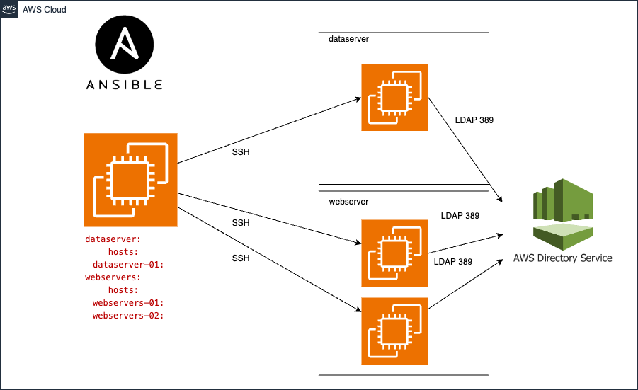
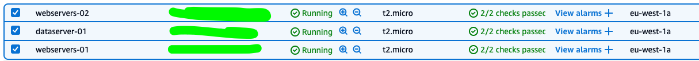
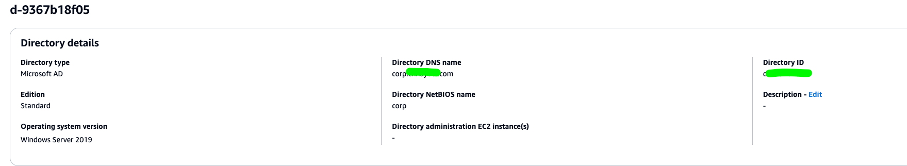
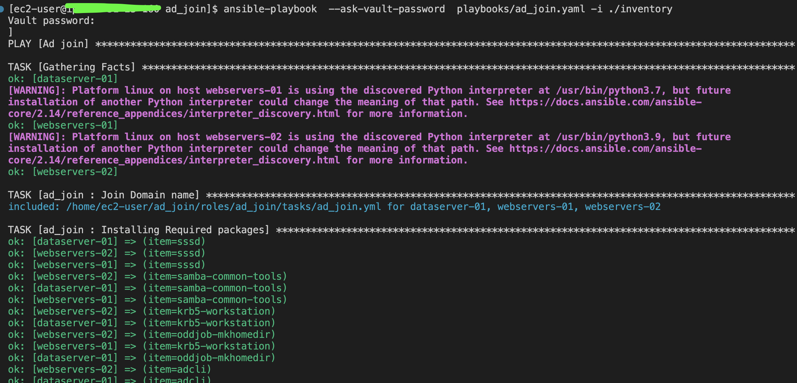
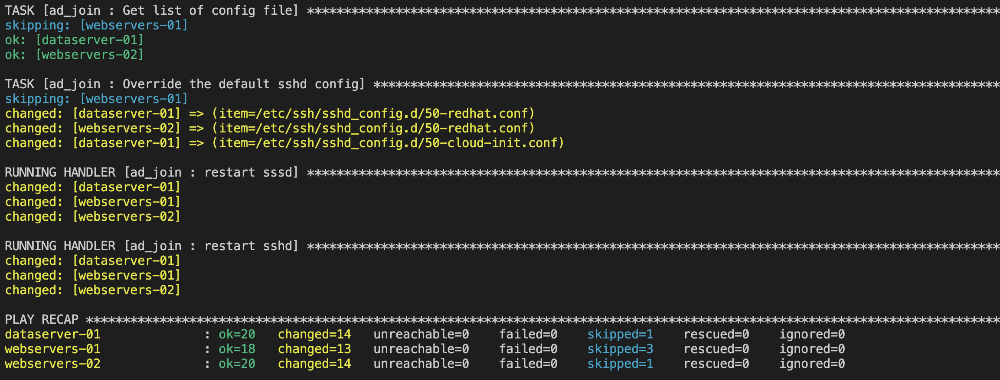
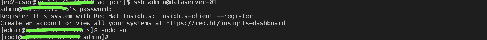
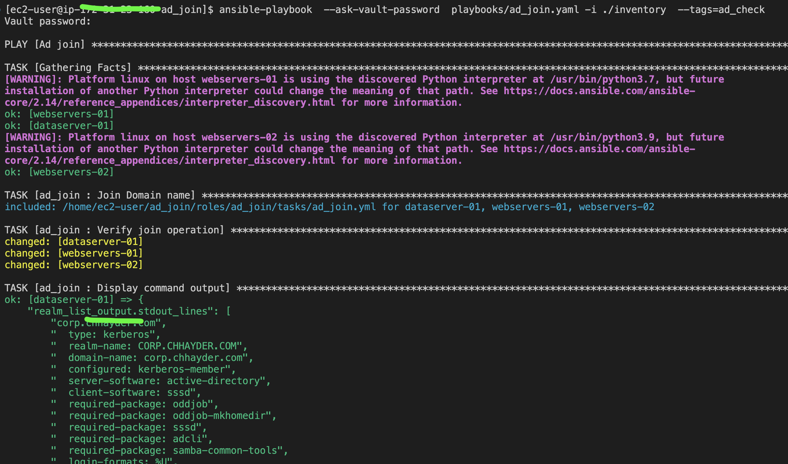
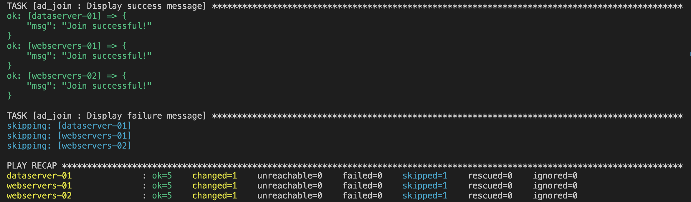
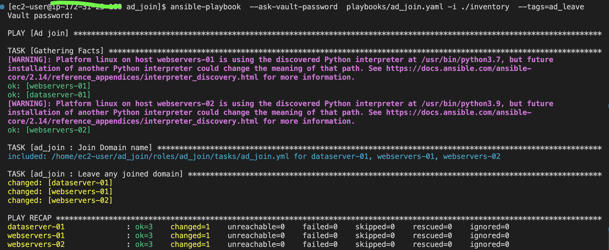
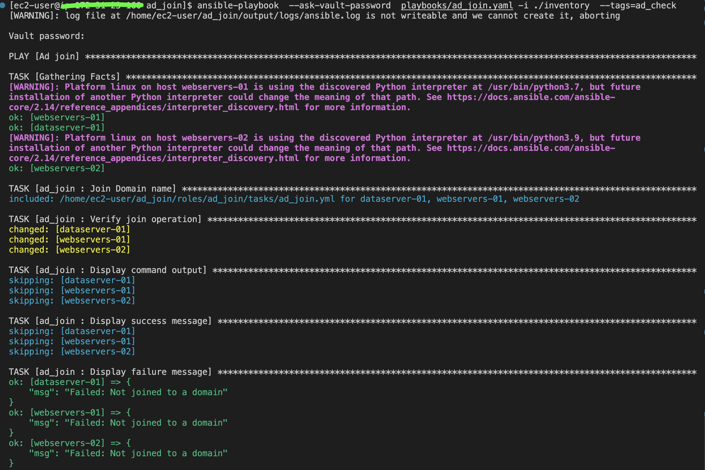

## Joining Linux Systems to an AD Domain using Ansible

Description: Automating the Process of Joining Linux Systems to an Active Directory Domain using Ansible and SSSD

### Project layout 




### Project structure
```bash
.
├── ansible.cfg # contains important Ansible settings that control how Ansible operates
├── ansible-navigator.log # output of ansible-navigator
├── CHANGELOG.md  #  Changelogs keep track of project versioning 
├── inventory
│   ├── groups # the groups file is used to define and organize host groups
│   ├── group_vars
│   │   ├── dataseserver.yml
│   │   └── department
│   │       ├── department.yml
│   │       └── vault.yaml # contains AD credatilas 
│   └── hosts.yml
├── output # output of ansible-playbook 
├── playbooks
│   └── ad_join.yaml # AD playbook 
├── README.md
└── roles # this hierarchy represents a "role"
    └── ad_join # ad_join role contains the steps to join the domain using the SSSD
        ├── CHANGELOG.md
        ├── defaults # define default variable values for the role.
        │   └── main.yml
        ├── files
        ├── handlers  # The handlers directory is used to define handlers,
        │   └── main.yml
        ├── meta  # defines metadata about an Ansible role
        │   └── main.yml
        ├── README.md
        ├── tasks 
        │   ├── ad_join.yml # Import all tasks to join the AD
        │   ├── check.yml # Check if the instance joined correctly the domaine.
        │   ├── discover.yml # Discover the defined AD: /usr/sbin/realm discover { domain }}
        │   ├── install.yml # Install the required Red Hat packages 
        │   ├── join.yml  # defines step to join the doamin and check: realm join -v -U admin  corp.example.com --install=/
        │   ├── leave.yml #  realm leave example.com
        │   ├── main.yml  # entry point for the role.
        │   ├── permit.yml # To allow all user access
        │   ├── sshd_config.yml # sshd_config config update 
        │   └── sssd_config.yml # sssd_config config update 
        ├── templates
        ├── tests
        │   ├── inventory
        │   └── test.yml
        └── vars
            └── main.yml  # Variables defined in this file are added to the role's variables and take precedence over the defaults/main.yml file.
```
To automate the process of joining Linux systems to an Active Directory (AD) domain using SSSD, follow these steps:

### 1 - Install needed dependencies

#### 1.1 Install Ansible 
on Ubuntu
```bash
sudo apt install ansible
```
on Centos 7
```bash
yum -y install ansible
```
on Centos 8
```bash
pip3 install ansible --user
```
On RHEL 7
```bash
sudo subscription-manager repos --enable rhel-7-server-ansible-2.9-rpms
yum -y install ansible
```
On RHEL 8
```bash
subscription-manager repos --enable  ansible-2.9-for-rhel-8-x86_64-rpms
yum install ansible
```
Or you can use ansible-navigator

```bash
sudo subscription-manager repos --enable ansible-automation-platform-2.0-early-access-for-rhel-8-x86_64-rpms
# Isntall ansible-navigator
dnf install ansible-navigator
```
On RHEL 9: 

```bash
sudo subscription-manager repos --enable ansible-automation-platform-2.2-for-rhel-9-x86_64-rpms
sudo dnf -y update
# Isntall ansible-navigator
sudo dnf -y install ansible-navigator
```

### 2 - Configure AWS Managed Microsoft AD Active Directory (Optional if you have already AD)

[Configure AWS Managed Microsoft AD Active Directory](https://medium.com/@medkamel555/configure-aws-managed-microsoft-ad-active-directory-and-join-your-linux-ec2-instance-to-the-domain-71fc5a0afaee)

[Directory services options in AWS](https://docs.aws.amazon.com/whitepapers/latest/active-directory-domain-services/directory-services-options-in-aws.html)

Ensure that your servers can resolve the domain name. You can use 'dig corp.example.com' to check.

Ensure that you can reach the domain name via LDAP port (389) and DNS port (53). You need to whitelist your outbound traffic to your AD server.

### 3 - Setup SSH Configuration 

You can use the cloud key-pair to connect to your instance or generate new ssh key as below :

```bash
ssh-keygen
```
Copy ssh-key to managed node
```bash
ssh-copy-id user@ip
```
Create config file
```bash
vim ~/.ssh/config
```
Add the following configuration to conig
```bash
Host dataserver-01
   Hostname 10.x.x.x
   User ec2-user
   IdentityFile ~/.ssh/id_rsa

Host webserver-01
   Hostname 10.x.x.x
   User ec2-user
   IdentityFile ~/.ssh/id_rsa
```

### 4 - Inventory configuration

#### 4.1 - Role default config. 

The 'ad_join' role has default variables. To use this role, you need to override the existing variables with your AD credentials. You need to provide the details to join Linux into the domain, like the domain user who has the right to add clients into the domain, DNS server, and user password. The default role variables are specified:

```yaml
ad_server:
    user: admin # Admin user
    pass: 'test' # Pass user
    domain: corp.exmple.com # domain name
    admin_group: "AWS Delegated Administrators" # Admin AD group
    ou_membership: OU=Computers,DC=example,DC=com # ou_membership
    admin_sudo: 'AWS\ Delegated\ Administrators' 
```

#### 4.2 - Inventory structure

The inventory is designed to be more generic for all IT organizations. You can create your customized inventory or override the existing one.

```yaml
[department]
[department:children]
dataseserver
webservers
[dataseserver]
[webservers] 

```
The databaseservers and webservers groups are part of the department group. Let's assume that you have two EC2 instances, one for the database server and the other for the web server. You would like to join both instances to the AD. So, we can add the AD configuration in the department group to override the role variables.

Under 'inventory/group_vars/department/department.yml':

```yaml
ad_server:
  user: "admin"
  domain: "corp.chhayder.com"
  admin_group: "AWS Delegated Administrators"
  admin_sudo: 'AWS\ Delegated\ Administrators'
```

Here, the last variable you need to override is pass. However, it is not a best practice to define a plain-text password. We need to provide the admin user password in a secure way to the inventory. Ansible Vault provides a way to encrypt and manage sensitive data such as passwords. For more information about Ansible Vault, please refer to:

[A brief introduction to Ansible Vault](https://www.redhat.com/sysadmin/introduction-ansible-vault)

### 4.2 - Update vault.yaml

TThe inventory includes inventory/group_vars/department/vault.yaml which contains the ad_server.pass definition. You simply need to edit this file and provide your AD password as follows:

```bash
ansible-vault edit inventory/group_vars/department/vault.yaml
```
Update the pass value key. 
```yaml
ad_server:
  pass: 'exmple'
```

### 5 - Launch the desired playbook

For ansible-playbook: You need to provide the password to decrypt vault.yaml:
```bash
ansible-playbook  --ask-vault-password  playbooks/ad_join.yaml -i ./inventory
```
For ansible-navigator: 
```bash
 ansible-navigator run -m stdout playbooks/ad_join.yaml --playbook-artifact-enable false  --vault-id one@prompt
 ```

### 6 - Testing :

To verify if your instance has already joined the domain, you can run the same playbook using the ad_check tag:

```bash
ansible-playbook  --ask-vault-password  playbooks/ad_join.yaml -i ./inventory --tags=ad_check
```
For ansible-navigator: 
```bash
 ansible-navigator run -m stdout playbooks/ad_join.yaml --playbook-artifact-enable false  --vault-id one@prompt --tags=ad_check
 ```

Or You can connect to the instance and run the follwoinfg commands.
```bash
sudo realm list
```
```bash
id __user_name__
```
```bash
ssh -l user@corp.exmple.com IPxxxxxxxxxx
```
The user can enter the username in either the username@example.com or EXAMPLE\username format. Then, you should be able to connect to the server with the specified user. Furthermore, if your user is part of the AWS Delegated Administrators group in the AD, it allows you to run programs with the security privileges.


### 7 - Leaving the domain

If you want to reverse the process and remove yourself from the domain, You can run the same playbook using the ad_leave tag:

```bash
ansible-playbook  --ask-vault-password  playbooks/ad_join.yaml -i ./inventory --tags=ad_leave
```
For ansible-navigator: 
```bash
 ansible-navigator run -m stdout playbooks/ad_join.yaml --playbook-artifact-enable false  --vault-id one@prompt --tags=ad_leave
 ```

Or you can simply run the ‘realm leave’ command followed by the domain name, as shown below.

```bash
realm leave example.com
```

### 8 - Exemple of execution

### 8.1 Lab description:

3 EC2 instance:

- RHEL 9.4 instance dataserver-01
- Amazon 2023 instance webservers-01
- Amazon 2 webservers-02




SSH Configuration

```bash
cat ~/.ssh/config 

Host dataserver-01
    HostName IPxx.xxx.xxx.xx
    User ec2-user
    IdentityFile ~/.ssh/xxx.pem

Host webservers-01
    HostName  IPxx.xxx.xxx.xx
    User ec2-user
    IdentityFile ~/.ssh/xxx.pem

Host  webservers-02
        Hostname IPxx.xxx.xxx.xx
        User ec2-user
        IdentityFile ~/.ssh/xxx.pem
```

AWS AD Directory



 
### 8.1 Join the domain for all EC2 instances







### 8.2 Testing








### 8.3 Leaving the domain



### 8.4 Checking again after leaving the domain

